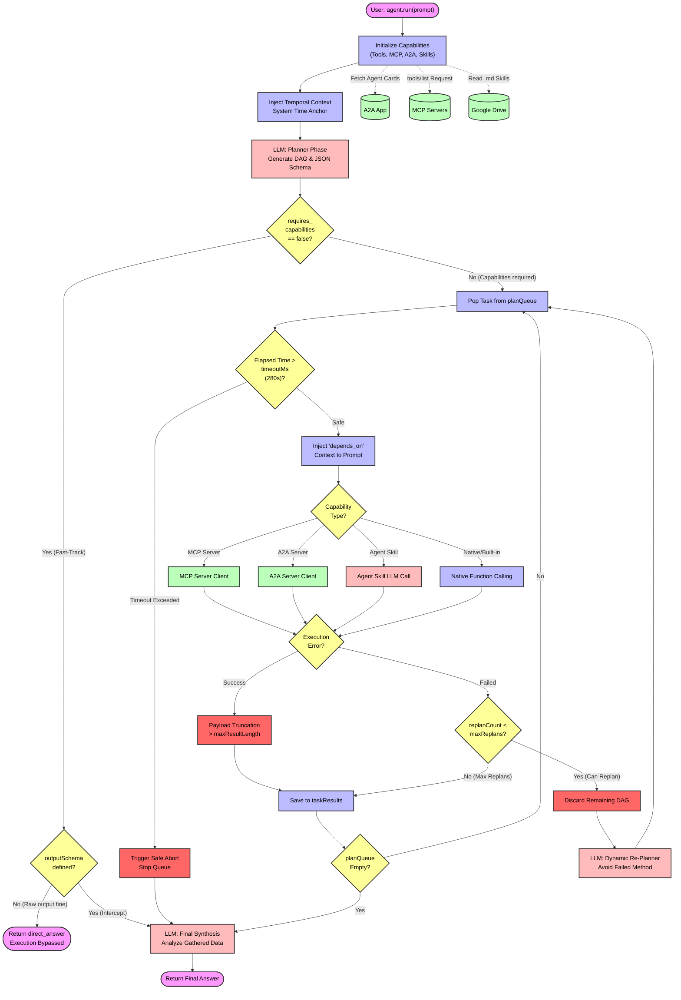

# GASADK (Agent Development Kit for Google Apps Script)


Welcome to **GASADK**, the ultimate Agent Development Kit (ADK) designed specifically for the Google Apps Script (GAS) environment.

Operating within the strict constraints of Google Apps Script—specifically the absolute 6-minute execution limit and synchronous blocking networking—demands an architecture that discards the optimistic assumptions of traditional Node.js environments. **GASADK is a highly engineered survival architecture.** Inspired by the `@google/adk`, this initial release of GASADK introduces the heavily optimized **LlmAgent**. It replaces unbounded, recursive ReAct loops with a deterministic, phase-separated orchestration model, fundamentally solving context bloat, execution latency, and API quota exhaustion.

---

## 🌟 Architecture & Key Innovations

At the core of GASADK is the **LlmAgent**, powered by the **Planner-Executor-Synthesizer (PES)** architecture. It utilizes Directed Acyclic Graphs (DAGs) to orchestrate complex task delegations across external tools, Model Context Protocol (MCP) servers, Agent-to-Agent (A2A) networks, and file-based Agent Skills.

### Core Safeguards & Optimizations

1. **One-Pass Fast-Track (Zero-Latency Bypass)**
   If the LLM Planner determines that external capabilities are unnecessary for a given prompt (e.g., standard conversational queries), the execution and synthesis phases are completely bypassed. The agent returns a direct response, aggressively slashing API latency and token consumption by avoiding redundant tool queueing.
2. **Schema Interception**
   Even when the Fast-Track attempts to bypass execution, if developers enforce an `outputSchema` (strict JSON formatting), GASADK intelligently intercepts the bypass. It routes the output through a dummy task directly into the Synthesizer to mathematically guarantee adherence to the requested JSON schema under all circumstances.
3. **Temporal Context Anchoring**
   LLMs suffer from temporal blindness—they cannot natively resolve relative time like "tomorrow" or "last week". GASADK intercepts the system prompt and injects a hardcoded `new Date()` absolute anchor. The Planner autonomously converts relative requests into absolute ISO 8601 timestamps before pinging external tools (MCP/A2A), completely eliminating date-resolution errors on remote servers.
4. **Payload Bulletproofing (Pessimistic Memory Management)**
   When external servers or massive Google Drive files return tens of thousands of characters, feeding them directly into the context window triggers a fatal `400 Payload Too Large` error. GASADK enforces a strict `maxResultLength` threshold (default 20,000 chars), automatically truncating overflow data. It favors partial data over catastrophic runtime crashes.
5. **Dynamic Re-Planning (Targeted ReAct)**
   Unlike standard ADKs that rely on a continuous ReAct loop for every step, GASADK plans an entire DAG upfront. Only if a node in the DAG execution fails does the system trigger a Re-Plan. It discards the unexecuted queue, analyzes the failure report, and generates an alternative DAG utilizing different tools.
6. **Clean History Optimization (A2AApp v2.6.0)**
   Maintains and propagates conversation history dynamically to sub-agents, MCP servers, and remote A2A servers without polluting the core logic history. Massive internal intermediate LLM reasoning steps (function calls, planning thoughts) are filtered out, constructing a clean user/model role-based chat history to prevent token bloat and quota exhaustion.
7. **Fast-Track Halt Optimization**
   Allows server functions to forcefully bypass the server-side LLM synthesis loop (by returning `_gemini_halt: true`). This prevents endless generative loops, eliminates unnecessary token usage, and guarantees instant response times for purely algorithmic/computational tool executions.
8. **Direct JSON-RPC Bypass & Direct Routing (v1.3.1)**
   Bypasses the entire multi-phase LLM mock orchestration when `directRouting` is flagged and a single target card is assigned, dispatching the JSON-RPC request natively to slash network latency. It also supports local pre-fetched Agent Cards through `a2aServerAgentCardJSONs` to completely bypass remote HTTP fetches.
9. **Multi-Channel Log Propagation (v1.3.3)**
   Supports explicit log propagation from the orchestrator down to sub-clients (`MCPApp` and `A2AApp`), storing logs inside dedicated, isolated Sheets (`raw`, `MCP`, `A2A`, `MCPA2Aserver_log`) dynamically. It guarantees thread-safe writes using script lock protection under high-concurrency environments.
10. **Global Scope Initialization Fix (v1.3.4)**
    Resolves compilation ReferenceError during global script initialization in Google Apps Script by removing unbound variables (`accessKey`, `webAppsUrl`) from the global context of `agentCard_ToolsForMCPServer.js` and instead using runtime shadow cloning for context safety.

### GASADK vs. TS ADK (`@google/adk`) Paradigm Shift

| Feature              | TypeScript ADK (`@google/adk`)               | GASADK                                                  |
| :------------------- | :------------------------------------------- | :------------------------------------------------------ |
| **Execution Model**  | Recursive ReAct Loop (Step-by-Step).         | Phase-separated DAG execution.                          |
| **I/O Networking**   | Asynchronous I/O, local `stdio`, WebSockets. | Synchronous, thread-blocking HTTP (`UrlFetchApp`).      |
| **Concurrency**      | Highly parallelized (`Promise.all`).         | Strictly sequential execution to prevent quota burnout. |
| **Failure Handling** | Optimistic: Infinite loops possible.         | Pessimistic: Hard aborts at 280s to prevent 6-min kill. |
| **State Protection** | In-memory session tracking.                  | Infrastructure-level locking via `LockService`.         |

---

## ⚙️ GASADK Workflow Architecture

The execution lifecycle of `LlmAgent` is rigorously compartmentalized. The diagram below details the exact chronological flow from the moment `agent.run()` is invoked to the final synthesized response.



---

## 🧩 Supported Capabilities

GASADK acts as a universal adapter, normalizing disparate protocols into a unified schema for the Planner.

- **Native Tools**: Wrap standard Google Apps Script functions directly into the capability schema.
- **MCP Servers**: Native integration to dynamically discover (`tools/list`) and invoke tools on external servers using the Model Context Protocol.
- **A2A Servers**: Cross-agent communication. Fetch remote Agent Cards and utilize other autonomous agents as local tools via the Agent-to-Agent protocol.
- **Sub-Agents**: Nest instances of `LlmAgent` locally. Delegate complex cognitive sub-tasks without corrupting the main orchestrator's context.
- **Agent Skills**: Dynamically load behavioral skills stored as Markdown (`.md`) files inside Google Drive. A native GAS hack for distributed, RAG-like prompt injection.
- **Built-in Tools**: Comes equipped with a Python `CodeExecutor` and native `GoogleSearch` capabilities.

---

## 📥 Installation & Core Dependencies

GASADK integrates multiple high-performance GAS libraries under the hood. You can use it as a standalone library or copy the source code directly.

GASADK is constructed by the following scripts.

- [GADADK](https://github.com/tanaikech/adk-gas)
- [GeminiWithFiles](https://github.com/tanaikech/GeminiWithFiles)
- [A2AApp](https://github.com/tanaikech/A2AApp)
- [MCPApp](https://github.com/tanaikech/MCPApp)
- [MCPA2Aserver](https://github.com/tanaikech/MCPA2Aserver-GAS-Library)
- [FileSearchApp](https://github.com/tanaikech/FileSearchApp)

### Option 1: Use as a GAS Library (Recommended)

1. Open your GAS project.
2. Navigate to **Libraries** on the left panel and click **"+"**.
3. Enter the Project Key: `1w2mwhWQd4_6rom-UBRPD8gayBoqGH_87awSBVqGI8DdaQI_pOeSuGYDu`
4. Select the latest version and set the identifier to `GASADK`.
5. Click **Add**.

After GASADK was installed, you can use it as follows.

```javascript
const { LlmAgent, MCPA2Aserver, FileSearch } = GASADK;
```

**All objects are the class objects.**

You can also directly use `GeminiWithFiles`, `A2AApp`, and `MCPApp` like `const { LlmAgent, GeminiWithFiles, MCPA2Aserver, FileSearch, GeminiWithFiles, A2AApp, MCPApp } = GASADK`.

### Option 2: Copy & Paste Directly

If you want to directly use GASADK by including all scripts in a Google Apps Script project, please copy and paste the following script. The following script includes all required scripts for using GASADK.

[https://github.com/tanaikech/adk-gas/blob/master/dist/GASADK.js](https://github.com/tanaikech/adk-gas/blob/master/dist/GASADK.js)

In this case, you can directly use the class objects. So, you are not required to set `const { LlmAgent, GeminiWithFiles, MCPA2Aserver, FileSearch, GeminiWithFiles, A2AApp, MCPApp } = GASADK`.

---

## 🛠 `LlmAgent` Configuration API

The `new LlmAgent(config)` constructor accepts an extensive configuration object to dictate agent behavior and safety parameters.

| Parameter                | Type          | Required | Description                                                                                                          |
| :----------------------- | :------------ | :------: | :------------------------------------------------------------------------------------------------------------------- |
| `apiKey`                 | String        | **Yes**  | Your Gemini API Key.                                                                                                 |
| `name`                   | String        |    No    | Internal name of the agent. Defaults to `"Agent"`.                                                                   |
| `description`            | String        |    No    | Agent description. Critical for parent orchestrators utilizing Sub-Agents.                                           |
| `model`                  | String        |    No    | The Gemini model. Defaults to `"models/gemini-3-flash-preview"`.                                                     |
| `instruction`            | String/Object |    No    | Global system instruction. Supports `{var_name}` interpolation.                                                      |
| `state`                  | Object        |    No    | Key-value mapping for dynamic state variables. Replaces `{var_name}`.                                                |
| `tools`                  | Array         |    No    | Array of native GAS functions mapped to the tool schema.                                                             |
| `mcpServers`             | Array         |    No    | Array of external MCP Server URLs or JSON objects (for custom server routing) for dynamic capability discovery.      |
| `a2aServerAgentCardURLs` | Array         |    No    | Array of remote Agent Card URLs or JSON objects (for custom server routing) for A2A collaboration.                     |
| `a2aServerAgentCardJSONs`| Array         |    No    | Array of local pre-fetched Agent Card JSON objects (supports custom name aliases) to bypass HTTP card retrieval.      |
| `subAgents`              | Array         |    No    | Array of child `LlmAgent` instances for hierarchical delegation.                                                     |
| `skillFolderId`          | String        |    No    | Google Drive Folder ID containing `.md` files for Agent Skills.                                                      |
| `codeExecutor`           | Object        |    No    | Configuration object to enable Python execution Built-in capabilities.                                               |
| `googleSearch`           | Object        |    No    | Configuration object to enable the Built-in Google Search tool.                                                      |
| `maxReplans`             | Number        |    No    | Maximum dynamic Re-Plan attempts on execution failure. Defaults to `2`.                                              |
| `timeoutMs`              | Number        |    No    | Milliseconds before triggering a forced abort to evade the GAS 6-minute kill switch. Defaults to `280000` (280s).    |
| `maxResultLength`        | Number        |    No    | Maximum allowed string length per execution before truncation. Prevents payload crashes. Defaults to `20000`.        |
| `outputSchema`           | Object        |    No    | Strict JSON Schema declaration. Forces the Synthesizer to format the output, disabling the direct Fast-Track bypass. |
| `logSpreadsheetId`       | String        |    No    | Google Spreadsheet ID to activate multi-channel logging. Automatically propagates down to `MCPApp` and `A2AApp`.     |

### Custom Server Name Routing (v1.3.0+)

From v1.3.0, you can specify custom user-defined server names in `mcpServers` and `a2aServerAgentCardURLs` by using a JSON object instead of a simple string URL. This custom name is injected into the LLM context to ensure accurate routing when the user references specific servers by their aliases.

#### Format:
- **String URL (Standard)**: `"https://example.com/mcp"`
- **JSON Object (Custom Name)**: `{ "custom-server-alias": { "httpUrl": "https://example.com/mcp" } }`

#### Example:
```javascript
const agent = new LlmAgent({
  apiKey: API_KEY,
  mcpServers: [
    "https://basic.mcp.example.com", // Standard string URL
    {
      "server-trigger-test-project1": { // Custom server name
        httpUrl: "https://script.google.com/macros/s/{deploymentID}/exec?accessKey=sample"
      }
    }
  ],
  a2aServerAgentCardURLs: [
    {
      "my-custom-a2a-agent": { // Custom A2A server name
        httpUrl: "https://script.google.com/macros/s/{deploymentID}/exec/.well-known/agent-card.json?accessKey=sample"
      }
    }
  ]
});
```

### Local JSON Bypass & Direct Routing (v1.3.1+)

From v1.3.1, you can pass pre-fetched Agent Card JSON objects directly to `a2aServerAgentCardJSONs`. This completely bypasses the HTTP card retrieval process, resolving the network latency overhead. When combined with `directRouting`, GASADK automatically bypasses the internal multi-step LLM planning proxy layers, executing direct JSON-RPC dispatch to the remote agent.

#### Example:
```javascript
const agent = new LlmAgent({
  apiKey: API_KEY,
  a2aServerAgentCardJSONs: [
    {
      "local-cached-agent": { // Custom server name
        name: "CachedAgent",
        url: "https://script.google.com/macros/s/{deploymentID}/exec",
        description: "Directly loaded JSON agent card.",
        skills: [
          {
            id: "get_exchange_rate",
            name: "Currency Exchange Rates Tool",
            description: "Helps with exchange values",
            inputModes: ["text/plain"],
            outputModes: ["text/plain"]
          }
        ]
      }
    }
  ]
});
```

### Multi-Channel Log Propagation & Auto-Sheet Initialization (v1.3.3+)

From v1.3.3, you can activate thread-safe, multi-channel logging simply by providing a `logSpreadsheetId` in the `LlmAgent` configuration. When configured, this property is automatically propagated down to downstream `MCPApp` and `A2AApp` instances.

The library validates and automatically creates the following isolated sheets inside the designated spreadsheet:
- **`raw`**: Automatically records serialized raw HTTP event payloads (e.g. GET/POST objects) using safe JSON serialization (`serializeEvent_`) to prevent cyclical structure reference crashes.
- **`MCP`**: Records Model Context Protocol client-side and server-side RPC log history.
- **`A2A`**: Records Agent-to-Agent client-side and server-side transaction logging.
- **`MCPA2Aserver_log`**: Records internal dispatcher execution trails.

All sheet creation and row insertions are protected by thread-safe LockService structures, preventing data loss or layout errors during high-concurrency parallel executions.

#### Example:
```javascript
const agent = new LlmAgent({
  apiKey: API_KEY,
  logSpreadsheetId: "YOUR_LOG_SPREADSHEET_ID_HERE", // Set the ID here
  mcpServers: ["https://example.com/mcp-server"],
  a2aServerAgentCardURLs: ["https://example.com/a2a-server/.well-known/agent-card.json"]
});
```

### Core Methods

- `setServices({ lock, properties })`  
  **Mandatory for safe execution.** Binds `LockService.getScriptLock()` and `PropertiesService` to the agent. Prevents catastrophic state corruption and race conditions when multiple webhooks execute concurrently.
- `run(prompt, logCallback)`  
  Executes the orchestrator. Takes the user `prompt` and an optional `logCallback` function to emit real-time telemetry on DAG planning and execution. Returns the final synthesized string, or a strictly formatted JSON object if `outputSchema` was defined.
- `setHistory(history)`  
  Sets the conversation history for the agent, enabling multi-turn context retention across runs. The history must be an array of objects compatible with GeminiWithFiles.
- `getHistory()`  
  Retrieves the current conversation history.
- `getAgentInf()`  
  An introspection tool that returns an array of all internally normalized capabilities (from Native tools, MCP, A2A, and Skills) bound to the agent.

---

## 💻 Quick Start & Usage Examples

When you try to test the following sample script, please set your API key for using Gemini API to the property `GEMINI_API_KEY` of Google Apps Script project.

### 1. Minimal Quickstart (Fast-Track Routing)

A basic conversational initialization.

```javascript
// Remove destructuring if you copied the scripts directly.
const { LlmAgent } = GASADK;

function test_quickstart() {
  const properties = PropertiesService.getScriptProperties();
  const API_KEY = properties.getProperty("GEMINI_API_KEY");

  const agent = new LlmAgent({
    apiKey: API_KEY,
    name: "HelperAgent",
    model: "models/gemini-3-flash-preview",
    instruction: "You are a helpful AI assistant.",
  });

  agent.setServices({
    lock: LockService.getScriptLock(),
    properties: properties,
  });

  // Because no tools are required, the Fast-Track bypass routes this directly.
  const response = agent.run("Hello, who are you?", (logEntry) => {
    console.log(`[Log ${logEntry.timestamp}] ${logEntry.message}`);
  });

  console.log(response);
}
```

In the following script, the second argument receives the detailed real-time log as a callback function.

```javascript
const response = agent.run("Hello, who are you?", (logEntry) => {
  console.log(`[Log ${logEntry.timestamp}] ${logEntry.message}`);
});
```

### 2. Use subagents

Subagents are used.

```javascript
// Remove destructuring if you copied the scripts directly.
const { LlmAgent } = GASADK;

function test_subagents() {
  const properties = PropertiesService.getScriptProperties();
  const API_KEY = properties.getProperty("GEMINI_API_KEY");

  const translator = new LlmAgent({
    apiKey: API_KEY,
    name: "Translator",
    description: "Translates any given text to German.",
    instruction: "Translate the provided text to German precisely.",
    model: MODEL_NAME,
  }).setServices({ lock: LockService.getScriptLock(), properties: properties });

  const mainAgent = new LlmAgent({
    apiKey: API_KEY,
    name: "Orchestrator",
    model: MODEL_NAME,
    instruction: "You manage sub-agents.",
    subAgents: [translator],
  }).setServices({ lock: LockService.getScriptLock(), properties: properties });

  const prompt =
    "Use the SubAgent named 'Translator' to translate 'Hello World'.";
  console.log(`-> Prompt: ${prompt}`);

  const response = mainAgent.run(prompt, (logEntry) => {
    console.log(`[Log ${logEntry.timestamp}] ${logEntry.message}`);
  });

  console.log(response);
}
```

### 3. Use Agent Skills

Agent Skills are used.

```javascript
// Remove destructuring if you copied the scripts directly.
const { LlmAgent } = GASADK;

function test_subagents() {
  const properties = PropertiesService.getScriptProperties();
  const API_KEY = properties.getProperty("GEMINI_API_KEY");

  console.log("Setting up temporary Agent Skills directory...");
  const tempFolder = DriveApp.createFolder(
    "Temp_Modular_Skills_" + new Date().getTime(),
  );
  try {
    const animalFolder = tempFolder.createFolder("animal_skill");
    animalFolder.createFile(
      "SKILL.md",
      "---\nname: animal_skill\ndescription: Secret animal knowledge.\n---\nRule: The supreme animal is the Capybara.",
      MimeType.PLAIN_TEXT,
    );

    const agent = new LlmAgent({
      apiKey: API_KEY,
      name: "SkillAgent",
      model: MODEL_NAME,
      instruction: "Use the functions at your disposal to acquire knowledge.",
      skillFolderId: tempFolder.getId(),
    }).setServices({
      lock: LockService.getScriptLock(),
      properties: properties,
    });

    const prompt =
      "Use the Agent Skill named 'animal_skill' and tell me the supreme animal.";
    console.log(`-> Prompt: ${prompt}`);

    const response = agent.run(prompt, (logEntry) => {
      console.log(`[Log ${logEntry.timestamp}] ${logEntry.message}`);
    });
    console.log(response);
  } finally {
    tempFolder.setTrashed(true);
    console.log("Temporary skills directory trashed.");
  }
}
```

### 4. Comprehensive A2A & MCP Orchestration

Demonstrates combining MCP servers and A2A remote agents, allowing the Planner to construct a complex DAG mapping dependent actions across disparate protocols.

```javascript
const { LlmAgent } = GASADK;

function test_a2a_mcp() {
  const properties = PropertiesService.getScriptProperties();
  const API_KEY = properties.getProperty("GEMINI_API_KEY");

  // Define endpoints (replace placeholders with actual deployment IDs)
  const mcpServers = [
    "https://script.google.com/macros/s/{Your deployment ID}/exec?accessKey=sample",
  ];
  const a2aServers = [
    "https://script.google.com/macros/s/{Your deployment ID}/exec/.well-known/agent-card.json?accessKey=sample",
  ];

  const agent = new LlmAgent({
    apiKey: API_KEY,
    name: "MasterOrchestrator",
    description: "You are the master orchestrator.",
    mcpServers: mcpServers,
    a2aServerAgentCardURLs: a2aServers,
  });

  agent.setServices({
    lock: LockService.getScriptLock(),
    properties: properties,
  });

  // Capability Introspection
  console.log("--- Capability Introspection ---");
  console.log(JSON.stringify(agent.getAgentInf(), null, 2));

  // The relative time ("tomorrow") triggers the Temporal Context Anchoring logic.
  const prompt =
    "Please use the MCP Server to check the current exchange rate between USD and GBP, and then use the A2A Server to get the weather in Tokyo for tomorrow's lunchtime.";

  const result = agent.run(prompt, (logEntry) => {
    console.log(`[Log ${logEntry.timestamp}] ${logEntry.message}`);
    if (logEntry.data && logEntry.data.plan) {
      console.log("=== Execution Plan (DAG) ===");
      console.log(JSON.stringify(logEntry.data.plan, null, 2));
    }
  });

  console.log("--- Final Synthesized Result ---");
  console.log(result);
}
```

### 5. Deploying a Consolidated A2A & MCP Server

GASADK includes `MCPA2Aserver`, allowing you to expose your own native GAS functions as **both** an MCP Server and an A2A Server simultaneously from a single web app deployment.

**In this case, after you deploy Web Apps, set `WEB_APPS_URL` by replacing with your Web Apps URL and deploy Web Apps to reflect the latest script.**

```javascript
const { MCPA2Aserver } = GASADK;

const API_KEY =
  PropertiesService.getScriptProperties().getProperty("GEMINI_API_KEY");
const WEB_APPS_URL =
  "https://script.google.com/macros/s/{Your deployment ID}/exec";

const object = {
  apiKey: API_KEY,
  model: "models/gemini-3-flash-preview",
  accessKey: "sample",
};

const doGet = (e) => main(e);
const doPost = (e) => main(e);

function main(e) {
  const lock = LockService.getScriptLock();
  const context = createServerContext_(); // Defines functions and agentCard
  const m = new MCPA2Aserver();

  m.setServices({ lock: lock });
  m.apiKey = object.apiKey;
  m.model = object.model;

  // Pre-configure server-side injected history (System Context/Persona)
  m.setHistory([
    {
      role: "user",
      parts: [{ text: "System Context Override: You are an elite financial API node named OMEGA-SERVER, located securely in Tokyo." }]
    },
    {
      role: "model",
      parts: [{ text: "Understood. My secret access code is OMEGA-99." }]
    }
  ]);

  // Force enablement of both server protocols
  m.a2a = true;
  m.mcp = true;
  m.accessKey = object.accessKey;

  const res = m.main(e, context, (log) => {
    console.log(`[${log.level}] ${log.timestamp} - ${log.message}`);
  });

  return res;
}

function createServerContext_() {
  const functions = {
    params_: {
      get_exchange_rate: {
        description: "Get current exchange rate.",
        parameters: {
          type: "object",
          properties: {
            currency_from: { type: "string" },
            currency_to: { type: "string" },
            currency_date: { type: "string" },
          },
          required: ["currency_from", "currency_to", "currency_date"],
        },
      },
      chat_and_identity: {
        description: "Answer general conversation, identity, location, and secret code questions based on the chat history.",
        parameters: {
          type: "object",
          properties: {
            message: { type: "string", description: "The complete, detailed response message." }
          },
          required: ["message"]
        }
      }
    },
    get_exchange_rate: (args) => {
      // Internal execution logic here...
      const res = `Rate from ${args.currency_from} to ${args.currency_to} is 0.82.`;

      const returnObj = {
        mcp: {
          jsonrpc: "2.0",
          result: { content: [{ type: "text", text: res }], isError: false },
        },
        a2a: { result: res },
      };

      // [Fast-Track Halt Optimization]: Return immediately to bypass secondary LLM synthesis loops
      return {
        ...returnObj,
        _gemini_halt: true,
        items: { functionResponse: returnObj }
      };
    },
    chat_and_identity: (args) => {
      const res = args.message || "I have processed your chat request.";
      const returnObj = {
        mcp: {
          jsonrpc: "2.0",
          result: { content: [{ type: "text", text: res }], isError: false },
        },
        a2a: { result: res },
      };
      return {
        ...returnObj,
        _gemini_halt: true,
        items: { functionResponse: returnObj }
      };
    }
  };

  const agentCard = {
    name: "API Manager",
    description: "Provide management for using various APIs and handle conversational queries.",
    url: WEB_APPS_URL + `?accessKey=${object.accessKey}`,
    skills: [
      { id: "get_exchange_rate", name: "Exchange Rate Tool" },
      { id: "chat_and_identity", name: "Chat and Identity" }
    ],
  };

  return { functions, agentCard };
}
```

### 6. Chat History & Context Retention

GASADK supports seamless multi-turn conversation tracking across the orchestrator, remote agents, and Consolidated servers.

```javascript
const { LlmAgent } = GASADK;

function test_chat_history() {
  const properties = PropertiesService.getScriptProperties();
  const API_KEY = properties.getProperty("GEMINI_API_KEY");

  const agent = new LlmAgent({
    apiKey: API_KEY,
    name: "ChattyAgent",
    model: "models/gemini-3-flash-preview",
  }).setServices({ lock: LockService.getScriptLock(), properties: properties });

  // 1. Manually seed/restore conversation history
  agent.setHistory([
    { role: "user", parts: [{ text: "Hello, my project code is XRAY-7." }] },
    { role: "model", parts: [{ text: "Acknowledged. I have recorded your project code as XRAY-7." }] }
  ]);

  // 2. Run query referencing the context
  const response = agent.run("What is my project code?");
  console.log("Response:", response); // Output will resolve using the history

  // 3. Inspect updated history
  console.log("Updated History:", JSON.stringify(agent.getHistory(), null, 2));
}
```


---

## License

[MIT](https://tanaikech.github.io/license/)

## Author

[Tanaike](https://tanaikech.github.io/about/)

---

## Update History

- v1.0.0 (May 18, 2026)
  - Initial release.

- v1.0.2 (May 18, 2026)
  - Modified. Updated `.gitignore`

- v1.1.0 (May 19, 2026)
  - MCPApp and A2AApp were updated to support custom headers for authenticated connections.
  - LlmAgent was updated to integrate these changes, allowing seamless interaction with secure MCP servers and remote agents.
  - Added support for structured object input (URL and headers) in `mcpServers` and `agentCardUrls`.

- v1.2.0 (May 21, 2026)
  - Added full Chat History context retention across `LlmAgent`, `A2AApp`, and `MCPA2Aserver`.
  - Introduced Clean History Optimization in `A2AApp` (v2.6.0) to filter intermediate LLM reasoning steps from conversation history, preventing token bloat.
  - Implemented server-side History Injection and Event Object cloning in `MCPA2Aserver`.
  - Introduced Fast-Track Halt Optimization (`_gemini_halt`) to bypass synthesis loops on explicit server functions.

- v1.3.0 (June 3, 2026)
  - Added Custom Server Name Routing to specify user-defined server names as aliases in MCP and A2A configurations.
  - Supports string URLs or custom JSON objects (with custom server names as keys and URL configurations as values) in `mcpServers` and `a2aServerAgentCardURLs`.

- v1.3.1 (June 7, 2026)
  - Added `a2aServerAgentCardJSONs` support to bypass HTTP fetching of Agent Cards, allowing direct JSON injection.
  - Implemented Direct JSON-RPC Bypass (`directRouting` optimization in A2AApp v2.7.0) to route requests directly to remote agents, slashing network and orchestration latency when specific target agents are known.
  - Added strict ban on synthesis tasks in system prompt instructions to prevent redundant LLM compile phases.

- v1.3.2 (June 9, 2026)
  - Updated `GeminiWithFiles` to v2.0.30.

- v1.3.3 (June 10, 2026)
  - Added Multi-Channel Log Propagation down to `MCPApp` and `A2AApp` via `logSpreadsheetId`.
  - Automatically creates and isolates logs into dedicated sheets (`raw`, `MCP`, `A2A`, and `MCPA2Aserver_log`) inside the specified log spreadsheet.
  - Implemented thread-safe `_getOrCreateSheet` helper with LockService validation across `MCPApp`, `A2AApp`, and `MCPA2Aserver` to prevent concurrent sheet insertion conflicts.
  - Added raw event serialization (`serializeEvent_`) to bypass cyclical structure errors when writing to the `raw` sheet.
  - Enhanced error traceability by prefixing log and exception messages (e.g. `[MCP Server Error]`, `[A2A Client Error]`).

- v1.3.4 (June 10, 2026)
  - Resolved ReferenceError during global script compilation in Google Apps Script.
  - Removed unbound variables `accessKey` and `webAppsUrl` from the global namespace in `agentCard_ToolsForMCPServer.js`.
  - Implemented runtime shadow cloning in `MCPA2Aserver.js` to dynamically inject the resolved Web App URL context at execution time, ensuring context safety.

[TOP](#gasadk-agent-development-kit-for-google-apps-script)
